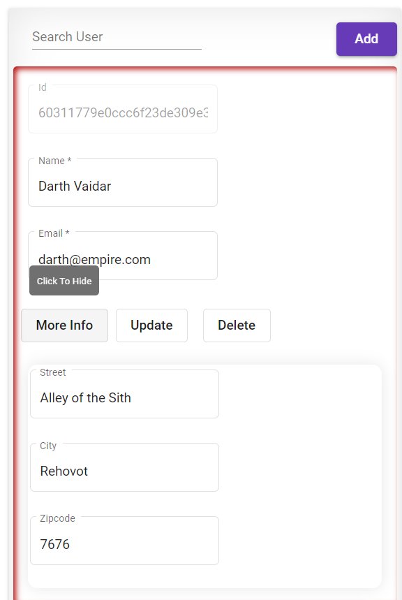
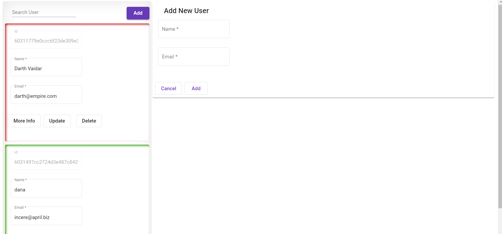
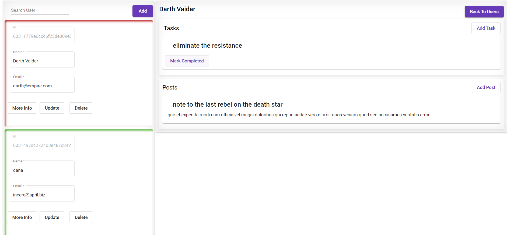
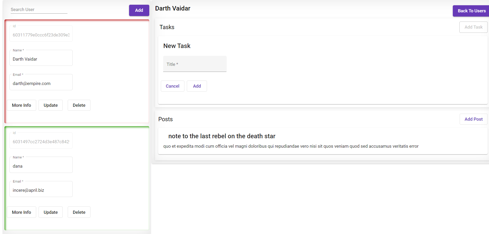

# MERN Users app

An app that displays users and thier tasks and posts -  developed using Angular, Node, Express and MongoDB.
This app enable two main different flows or implementations:

1. Users - add a new user, search user, update and delete
2. Selecting a user and manage his tasks and posts

## Core Packages
1. Angular Router (for routing)
2. Angular Material (for styling)

## UI

### Home 

### Add User

### User Todos and Posts

### Add Task

